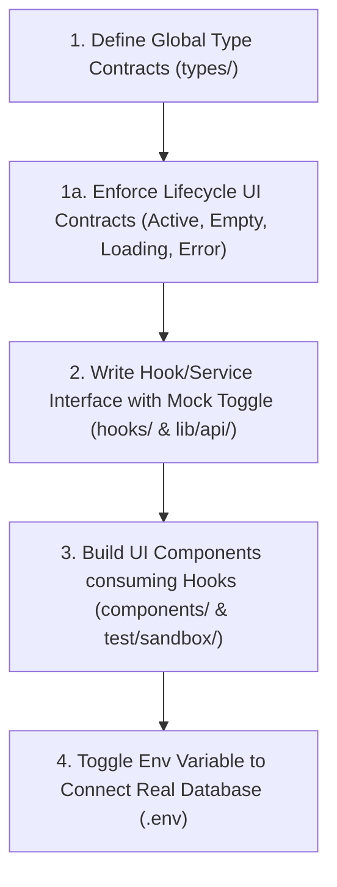

# Sandbox Prototype to Production Migration Guide

This document establishes the universal guidelines for designing and migrating visual mockups (from the sandbox) to the production app. To avoid the hectic process of refactoring and separating mock data *after* code is already written, developers and AI agents must follow the **Golden Order of Prototyping** from Day One.

By structuring simulated code correctly at the start, transitioning to real APIs requires **zero changes to component files**; it is handled entirely by toggling environment flags or state providers.

---

## 🏆 1. The Golden Order of Prototyping (Migration from Day One)

When building any interactive UI widget or dashboard screen, developers/agents must write code in this specific chronological order:



### Step 1: Define Global Type Contracts First
Before writing any UI or mock data, define the TypeScript interface in the `types/` folder (e.g. `types/receipt.ts`).
* *Why:* Ensures the sandbox data and production API share the exact same keys and constraints from the start.

### Step 1a: Enforce Lifecycle UI Contracts (Active, Empty, Loading, Error)
The data contract defined in Step 1 must explicitly include states for empty lists, pending loading states, and API failures. Components designed in the sandbox must handle and visually render all core states:
* **Active State**: Populated list items.
* **Loading State**: Shimmer lines, skeleton loader screens, or spinners while data fetching is active.
* **Empty State**: Custom illustration/text when the hook returns an empty array `[]` (e.g., "No receipts scanned yet. Use Ingestion to add documents.").
* **Error State**: A fallback UI component with a "Retry" button when the hook returns an error object or fails.

### Step 2: Write the State Hook/Service with a Mock Toggle
Create the hook (e.g., `hooks/use-receipts.ts`) *before* building the UI. Implement an internal switch based on environment variables:
```typescript
// hooks/use-receipts.ts
export function useReceipts() {
  const [receipts, setReceipts] = useState<Receipt[]>([]);
  const [loading, setLoading] = useState(true);
  const [error, setError] = useState<Error | null>(null);

  const loadData = async () => {
    setLoading(true);
    setError(null);
    try {
      if (process.env.EXPO_PUBLIC_USE_MOCK_APIS === 'true') {
        // Load local demo sandbox data
        setReceipts(mockDemoReceipts);
      } else {
        // Fetch live production database entries (example API fetch wrappers)
        const liveData = await fetchLiveDatabase();
        setReceipts(liveData);
      }
    } catch (e) {
      setError(e as Error);
    } finally {
      setLoading(false);
    }
  };

  useEffect(() => {
    loadData();
  }, []);

  const addReceipt = async (newReceipt: Receipt) => {
    if (process.env.EXPO_PUBLIC_USE_MOCK_APIS === 'true') {
      setReceipts(prev => [newReceipt, ...prev]);
    } else {
      await saveToDatabase(newReceipt);
    }
  };

  const updateReceipt = async (updated: Receipt) => {
    if (process.env.EXPO_PUBLIC_USE_MOCK_APIS === 'true') {
      setReceipts(prev => prev.map(r => r.id === updated.id ? updated : r));
    } else {
      await updateInDatabase(updated);
    }
  };

  const deleteReceipt = async (id: string) => {
    if (process.env.EXPO_PUBLIC_USE_MOCK_APIS === 'true') {
      setReceipts(prev => prev.filter(r => r.id !== id));
    } else {
      await deleteFromDatabase(id);
    }
  };

  return { 
    receipts, 
    loading, 
    error, 
    addReceipt, 
    updateReceipt, 
    deleteReceipt, 
    refetch: loadData 
  };
}
```

### Step 3: Build UI Components Consuming the Hook
Build the visual layout files. They must import and consume the hook directly:
```typescript
// app/(dashboard)/index.tsx or test/sandbox/index.tsx
import React, { useState } from 'react';
import { View } from 'react-native';
import { useReceipts } from '@/hooks/use-receipts';
import ReceiptList from '@/components/features/ReceiptList';
import ReceiptDetailDrawer from '@/components/layout/ReceiptDetailDrawer';
import LoadingScreen from '@/components/ui/LoadingScreen';
import ErrorScreen from '@/components/ui/ErrorScreen';
import EmptyPlaceholderScreen from '@/components/ui/EmptyPlaceholderScreen';

export default function Dashboard() {
  const { 
    receipts, 
    loading, 
    error, 
    addReceipt, 
    updateReceipt, 
    deleteReceipt, 
    refetch 
  } = useReceipts();
  
  const [selectedReceipt, setSelectedReceipt] = useState<Receipt | null>(null);
  
  if (loading) return <LoadingScreen />;
  if (error) return <ErrorScreen onRetry={refetch} />;
  if (receipts.length === 0) return <EmptyPlaceholderScreen onScan={addReceipt} />;
  
  return (
    <View style={{ flex: 1 }}>
      <ReceiptList 
        items={receipts} 
        onScan={addReceipt} 
        onSelectReceipt={setSelectedReceipt} 
      />
      
      <ReceiptDetailDrawer
        receipt={selectedReceipt}
        onClose={() => setSelectedReceipt(null)}
        onUpdateReceipt={updateReceipt}
        onDeleteReceipt={deleteReceipt}
      />
    </View>
  );
}
```

### Step 4: Toggle the Ingestion State in `.env`
When live APIs are ready, **do not touch any of the UI files**. Simply update the environment file:
```env
# Switch from local demo simulation to live server feeds instantly
EXPO_PUBLIC_USE_MOCK_APIS=false
```

---

## 🔄 2. State-Driven Animation Lifecycles

To ensure animations (such as scanning HUDs, uploading progress bars, and syncing log consoles) run smoothly during both mock simulation and live network calls, they must be tied to a standard **async lifecycle state**.

### Visual State Lifecycle Hookup
```typescript
const [status, setStatus] = useState<'idle' | 'pending' | 'success' | 'error'>('idle');

const handleUserAction = async (payload: any) => {
  setStatus('pending'); // Triggers visual scan/sync animations automatically
  
  try {
    const result = await processDataIngestion(payload); // Decoupled Service call
    onActionComplete(result);
    setStatus('success'); // Stops animations / displays success indicators
  } catch (error) {
    setStatus('error'); // Halts animations / displays warning banner
  }
};

return (
  <View>
    {/* Animation plays automatically as long as status is 'pending' */}
    {status === 'pending' && <AnimationOverlay />} 
    <Button onPress={handleUserAction} />
  </View>
);
```

---

## 🔐 3. Unified Authentication Mocking

Authentication hooks (e.g. `useAuth()`) must support mock injection to prevent login blockers during sandbox development:

* **The Auth Switch**: `useAuth()` must check the `EXPO_PUBLIC_USE_MOCK_APIS` flag.
* **Sandbox Bypassing Session**: If the flag is `true`, `useAuth()` must immediately bypass hardware/network authentication requests and return a dummy user object `{ id: "mock-123", email: "tester@domain.com" }` and `isAuthenticated: true`.
* **Zero Login Obstacles**: This guarantees that while reviewing, testing, or building components inside the sandbox port, developers and agents are never blocked by MFA, biometric, or network login pages when accessing protected features and views.

---

## ⚠️ 4. Expo & React Native Reality Checks

To ensure this model executes flawlessly, developers must keep these two Metro bundler nuances in mind:

### Reality Check A: Metro Bundler Caching
Expo reads environment variables prefixed with `EXPO_PUBLIC_` during the build step. When you toggle `EXPO_PUBLIC_USE_MOCK_APIS=false` in your `.env` file, Metro will sometimes serve up a cached version of the old value.
* **The Rule**: Whenever you change a toggle inside `.env`, you **must** restart the Expo server and clear the cache flag:
  ```bash
  npx expo start -c
  ```

### Reality Check B: Stateful Mocking for "Interactive" Sandbox
If a user triggers an action (such as "Delete Receipt" or "Scan Item") in the Sandbox, and you want the layout to instantly react (e.g. card vanishes, spending meter recalculates), your hook cannot just read a static, immutable JSON file directly on every render.
* **The Rule**: Inside the hook's mock branch, you must initialize the mock JSON data inside a local React `useState` array:
  ```typescript
  const [receipts, setReceipts] = useState<Receipt[]>(mockJsonData);
  ```
  Functions like `deleteReceipt()` must filter this local state. This guarantees that components react interactively to clicks without writing to any backend database.

---

## 📊 5. Scale & Growth Guardrails (For Large Production Datasets)

As the application moves out of the sandbox and grows larger in production, developers must respect the following architectural guardrails:

### A. List Rendering Performance (Large Feeds)
Mapping an array directly inside a `<ScrollView>` (e.g. `{receipts.map(...) }`) forces React Native to render all elements at once, which will severely lag or crash the application when listing 100+ items.
* **The Rule**: Use React Native's `<FlatList>` instead of mapping inside ScrollViews. FlatList recycles off-screen visual components.
* **Paginated Hook Contracts**: Ensure custom hooks support pagination parameters from the start:
  ```typescript
  // Future-proof hook output signature
  const { receipts, loading, hasMore, fetchNextPage } = useReceipts();
  ```

### B. Offline-First Storage Caching
A simple `fetch()` implementation inside hooks will cause the app to display the `Error State` instantly if the user is in a location with no network reception.
* **The Rule**: When `EXPO_PUBLIC_USE_MOCK_APIS=false`, the production hook must cache data locally (using a lightweight engine like MMKV or SQLite) before syncing with the backend API. The hook should load and display the local cache *first*, then update in the background when a connection is established.

### C. Cross-Platform Style Safety (Web vs Native)
Web-specific CSS properties (like linear gradients, filters, cursors, or grid layouts) inside React Native `StyleSheet.create` will cause the bundler to crash when compiled for native iOS and Android.
* **The Rule**: Always wrap web-specific style parameters inside `Platform.select({ web: { ... } })` and assert the container styling object `as any`. This allows compiling safety for mobile targets while rendering rich details on web screens.

### D. Clear Env Variable Roles
Do not confuse environment configuration roles:
* `EXPO_PUBLIC_APP_MODE`: Controls **routing entry points** (toggles between mounting Sandbox screens or Production screens at the root `app/index.tsx`).
* `EXPO_PUBLIC_USE_MOCK_APIS`: Controls **data extraction & authentication** (toggles between loading simulated values/dummy states or making actual HTTP network requests).
* *Note:* You can run the Production screens on port 8081 but set `EXPO_PUBLIC_USE_MOCK_APIS=true` to test production layout flows with local mock data.
